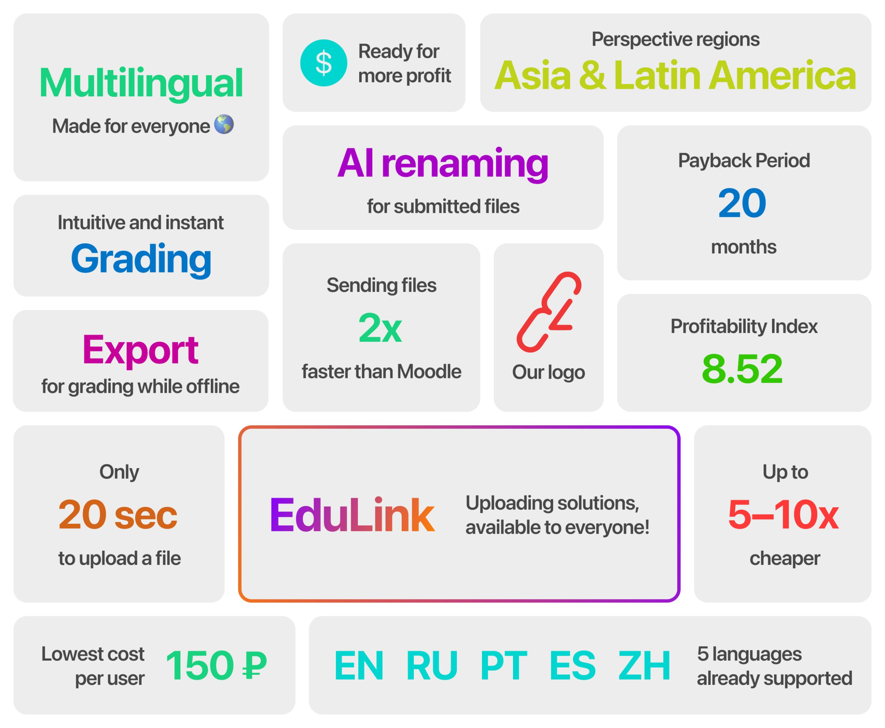

# EduLink

Telegram bot that simplifies homeworks exchange, for students and teachers. Available at [@LinkEduBot](https://t.me/LinkEduBot)

Developed as part of product for [Central University](https://centraluniversity.ru) bootcamp in March 2025



## Setup

1. Copy .env.dist to .env
2. Fill API_ID and API_HASH with params from [https://my.telegram.org](https://my.telegram.org)
3. Fill BOT_TOKEN with token from [@BotFather](https://t.me/BotFather)
4. Set UPLOAD_FILES_CHAT_ID to ID of any trusted Telegram chat, such as your own ID or empty group with bot added
5. Set YANDEX_API_KEY and YANDEX_FOLDER_ID with credentials from [Yandex Cloud](https://yandex.cloud/ru/services/yandexgpt) (Yandex GPT is used for summarization)

## Run

### Manually

1. Set DATABASE_URL to `sqlite://db.sqlite3` in `.env` file
2. `pip install -r requirements.txt`
3. `pybabel compile -d locales/`
4. `python -m app`

### Docker
```bash
docker-compose up -d
```